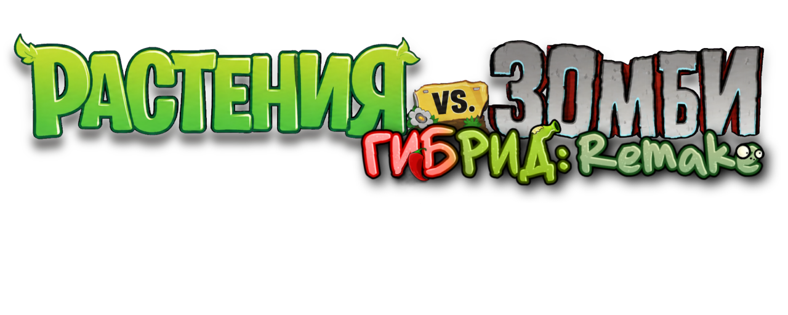

  

  # PvZ Hybrid Remake RU

  **Русская локализация PvZ Hybrid Remake**

  
  
  
  

  [О проекте](#что-это) · [Что переведено](#что-переведено) · [Скачать](#скачать) · [Установка](#установка) · [Обратная связь](#обратная-связь)

---

## Что это

**PvZ Hybrid Remake RU** — фанатская русская локализация **PvZ Hybrid Remake 0.25.5**. Проект делает игру понятнее для русскоязычных игроков, сохраняя её оригинальный стиль и настроение.

Русификатор распространяется бесплатно и не является официальным продуктом разработчиков игры.

## Что переведено

- интерфейс и основные меню;
- названия растений и зомби;
- игровые режимы;
- описания и диалоги;
- альманах;
- значительная часть графики с китайским текстом;
- отдельные визуальные элементы, перерисованные вручную.

## Статус версии

**0.5 — первый публичный релиз локализации.**

Перевод уже пригоден для нормального прохождения и знакомства с игрой. Визуальная часть продолжит улучшаться: местами ещё могут встречаться забытые китайские надписи, небольшие ошибки или визуальные баги.

Если вы нашли проблему, отправьте [в Telegram-канал проекта](https://t.me/ModsForPvZ) скриншот и короткое описание — так её будет проще проверить и исправить.

## Скачать

[**Скачать PvZ Hybrid Remake RU v0.5**](https://github.com/keiros06/PVZHR-RU/releases/tag/v0.5)

Новости проекта и объявления о новых версиях публикуются в [Mods for PvZ](https://t.me/ModsForPvZ).

## Установка

> **Инструкция будет добавлена к релизу.**

## Обратная связь

Основной канал проекта — [**Mods for PvZ**](https://t.me/ModsForPvZ).

Туда можно отправлять:

- багрепорты и скриншоты;
- найденные опечатки или непереведённые места;
- предложения по улучшению;
- предложения помощи с графикой и тестированием;
- другие вопросы по проекту.

## Поддержать автора

Локализация бесплатная. Если вам нравится проект, при желании можно [добровольно поддержать дальнейшую работу](https://donatty.com/Keiros06).

## Команда проекта

**Keiros06** — автор текста и автор проекта  
**RebuS** — главный художник и PR-менеджер  
**alicest** — помощник по визуалу

Отдельное спасибо всем, кто помогал с тестированием и поиском ошибок.

---

  **PvZ Hybrid Remake RU by Keiros06**

